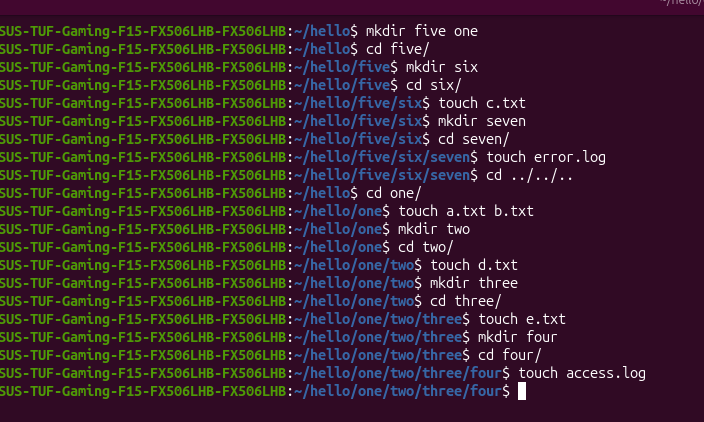

## Directory Structure

```text
hello
├── five
│   └── six
│       ├── c.txt
│       └── seven
│           └── error.log
└── one
    ├── a.txt
    ├── b.txt
    └── two
        ├── d.txt
        └── three
            ├── e.txt
            └── four
                └── access.log
```

## Creating the Directory Tree

Run the following commands to create the above structure:

```bash
mkdir hello
cd hello

mkdir five one

cd five/
mkdir six
cd six/

touch c.txt
mkdir seven
cd seven/

touch error.log

cd ../../..

cd one/

touch a.txt b.txt

mkdir two
cd two/

touch d.txt

mkdir three
cd three/

touch e.txt

mkdir four
cd four/

touch access.log
```

<p align="center">
  
</p>

---

# Questions

## 1) Delete all files having the .log extension

### Command

```bash
find hello -type f -name "*.log" -delete
```

### Explanation

- find - Searches for files and directories.
- hello - The directory where the search starts.
- -type f - Searches only for files (not directories).
- -name "*.log" - Matches files ending with `.log`.
- -delete - Deletes the matched files.

---

## 2) Add content to `a.txt`

### Command

```bash
echo "Unix is a family of multitasking, multiuser computer operating systems that derive from the original AT&T Unix, development starting in the 1970s at the Bell Labs research center by Ken Thompson, Dennis Ritchie, and others" > one/a.txt
```

### Explanation

- echo - Prints the given text.
- `>` - Redirects the output into a file.
- one/a.txt - The file where the content is stored.

---

## 3) Delete the directory named five

### Command

```bash
rm -r five
```

### Explanation

- `rm` - Removes files and directories.
- `-r` - Recursive deletion.

The entire `five` directory will be removed.

---

## 4) Rename the `one` directory to `uno`

### Command

```bash
mv one uno
```

### Explanation

- `mv` - Moves or renames files and directories.
- `one` - Current directory name.
- `uno` - New directory name.
---

## 5) Move a.txt to the two directory

### Command

```bash
mv uno/a.txt uno/two/
```

### Explanation

- `mv` - Moves files or directories.
- `uno/a.txt` - Source file.
- `uno/two/` - Destination directory.

---
